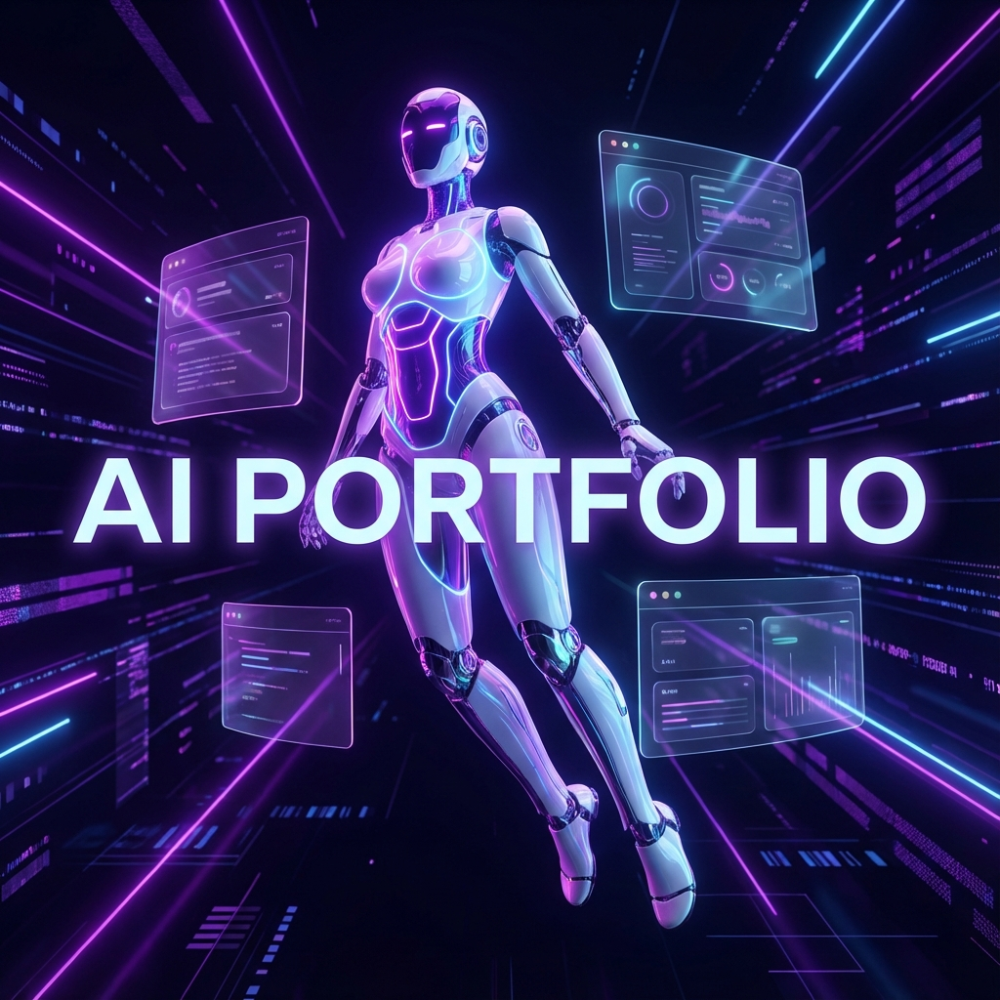

# 🤖 AI Portfolio | Next-Gen MERN Showcase



[](https://www.mongodb.com/mern-stack)
[](https://reactjs.org/)
[](https://nodejs.org/)
[](https://www.mongodb.com/)
[](https://groq.com/)

A premium, interactive portfolio platform that blends high-end design with artificial intelligence. Built with the MERN stack, it features a custom-animated AI sidekick and a brain powered by LLMs.

---

## ✨ Key Features

### 👤 Interactive EVE Robot
- **Dynamic Awareness**: A custom CSS-animated character that tracks your mouse cursor with smooth, lifelike movement.
- **Micro-Animations**: Experience fluid transitions and floating effects that bring the interface to life.

### 🤖 AI Assistant (Groq Cloud)
- **Direct Engagement**: Integrated chatbot using Groq's high-performance LLM (Llama 3) to answer questions about the developer.
- **Context-Aware**: The AI is grounded in your professional profile, skills, and projects.

### 📊 Professional Management
- **Full-Featured Admin Panel**: Manage projects, skills, and experience through a secure, glassmorphic dashboard.
- **Analytics Engine**: Built-in tracking for project views and engagement metrics.
- **Cloudinary Integration**: High-performance image hosting for project gallery items.

### 🎨 Modern UI/UX
- **Glassmorphism Design**: High-end translucent elements with blur effects.
- **Responsive & Fluid**: Fully optimized for mobile, tablet, and desktop viewing.

---

## 🛠️ Tech Stack

- **Frontend**: React.js, Vite, Axios, Lucide Icons
- **Backend**: Node.js, Express.js, MongoDB (Atlas/Local)
- **AI/LLM**: Groq Cloud SDK (Llama 3 70B)
- **Auth**: JSON Web Tokens (JWT) & Bcrypt
- **Assets**: Cloudinary API for optimized image delivery
- **Styling**: Vanilla CSS with modern Flexbox/Grid layouts

---

## 🚀 Getting Started

### Prerequisites
- Node.js (v18+)
- MongoDB (Running locally or an Atlas connection string)
- Groq API Key ([Get one here](https://console.groq.com/keys))
- Cloudinary Credentials

### 1. Installation
Clone the repo and install all dependencies:
```bash
npm run install-all
```

### 2. Environment Configuration
Create a `.env` file in the `server` directory:
```env
PORT=5000
MONGODB_URI=your_mongodb_uri
JWT_SECRET=your_secure_random_string
GROQ_API_KEY=your_groq_api_key
CLOUDINARY_CLOUD_NAME=your_name
CLOUDINARY_API_KEY=your_key
CLOUDINARY_API_SECRET=your_secret
CLIENT_URL=http://localhost:5173
```

### 3. Launch
```bash
# Start both Client and Server
npm run dev
```

---

## 📁 Project Structure

```text
ai-portfolio/
├── client/              # React frontend (Vite)
│   ├── src/components/  # Modular UI components
│   ├── src/utils/       # API services & helpers
│   └── src/assets/      # Local static assets
├── server/              # Node/Express backend
│   ├── models/          # Mongoose schemas
│   ├── routes/          # API endpoints
│   ├── services/        # AI & Cloudinary logic
│   └── config/          # Database & tool configs
└── assets/              # README resources & banner
```

---

## 🤝 Contributing
Contributions are welcome! Please feel free to submit a Pull Request.

## 📄 License
Balanced under the MIT License.

---
*Created by Althaf*
